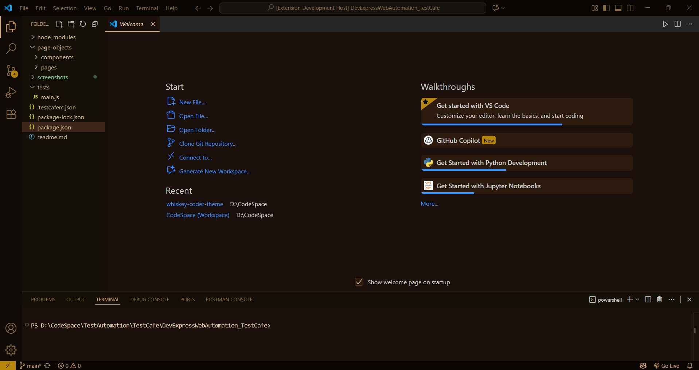
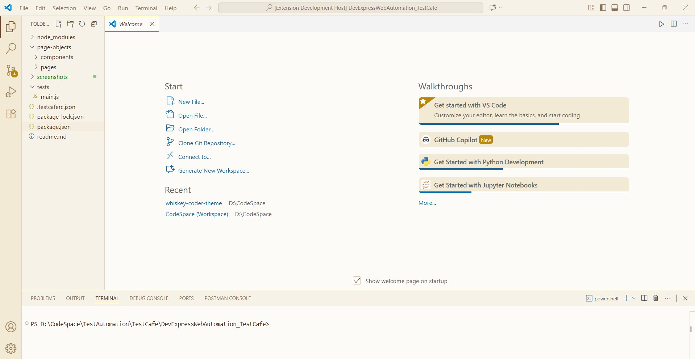
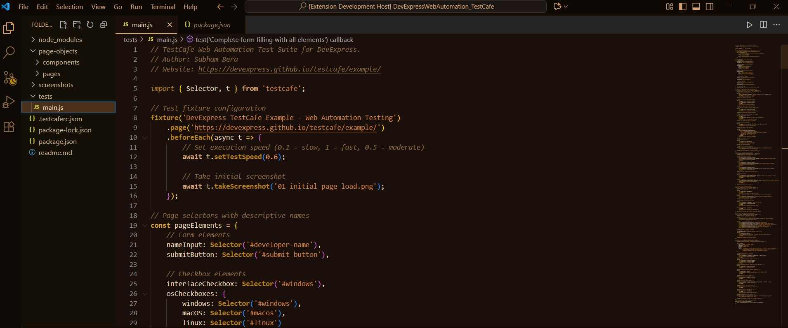
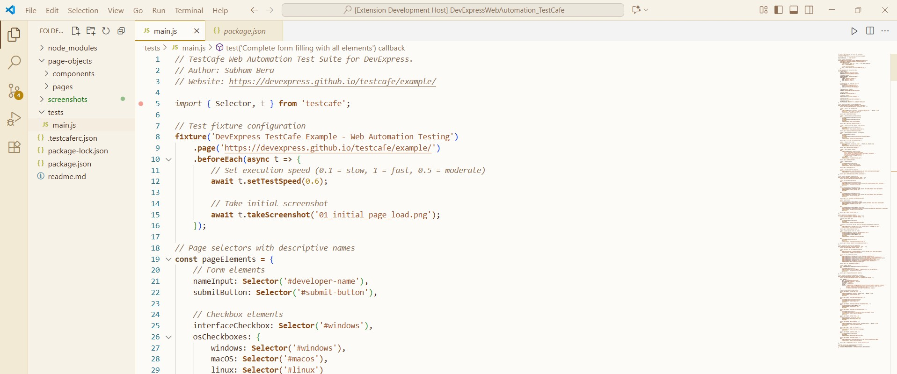

# 🥃 Whiskey Coder Theme Collection

> *A sophisticated, whiskey-inspired theme collection for Visual Studio Code featuring both dark and light variants that transform your coding environment into a warm, elegant workspace.*

<div align="center">


**Two Premium Themes • One Elegant Experience**

</div>

---

## 🌟 Theme Variants

### 🌙 Whiskey Coder Dark
*Perfect for late-night coding sessions and low-light environments*

**Inspiration**: Deep whiskey barrels, aged oak, and candlelit distilleries

### ☀️ Whiskey Coder Light  
*Ideal for bright workspaces and daytime productivity*

**Inspiration**: Golden honey, cream whiskey, and warm morning light

---

## 📸 Visual Showcase

<div align="center">
  
### 🌙 Dark Theme Preview

<p><em>Rich, warm dark theme with deep whiskey barrel tones</em></p>

### ☀️ Light Theme Preview  

<p><em>Elegant light theme with golden honey and cream accents</em></p>

### 🔄 Side-by-Side Comparison
<table>
  <tr>
    <th>🌙 Dark Theme</th>
    <th>☀️ Light Theme</th>
  </tr>
  <tr>
    <td></td>
    <td></td>
  </tr>
  <tr>
    <td align="center"><em>Deep, rich syntax highlighting</em></td>
    <td align="center"><em>Clean, sophisticated highlighting</em></td>
  </tr>
</table>

</div>

<details>
<summary>🔍 View More Language Examples</summary>

### Syntax Highlighting Showcase

**JavaScript/TypeScript**
- Dark: Perfect for complex logic with soothing amber accents
- Light: Clean, readable with professional brown tones

**HTML/CSS**
- Dark: Elegant tag highlighting with whiskey-golden attributes  
- Light: Crisp, clean markup with honey-colored properties

**Python/Java**
- Dark: Rich function names in bourbon gold
- Light: Professional class definitions in oak brown

**JSON/YAML**
- Dark: Glowing keys like aged whiskey
- Light: Sophisticated structure in caramel tones

</details>

---

## 🎨 Color Philosophy

### 🌙 Dark Theme Palette
Inspired by the sophisticated world of aged whiskey and oak barrels:

| Element | Color | Inspiration |
|---------|-------|-------------|
| **Background** | `#1a0f0a` | Deep whiskey barrel interior |
| **Foreground** | `#e6d4b7` | Rich cream foam |
| **Primary Accent** | `#d4a574` | Golden amber whiskey |
| **Secondary** | `#daa520` | Aged bourbon glow |
| **Highlights** | `#b8860b` | Liquid gold shine |

### ☀️ Light Theme Palette  
Inspired by morning whiskey tastings and honey-colored spirits:

| Element | Color | Inspiration |
|---------|-------|-------------|
| **Background** | `#fdfbf7` | Creamy whiskey foam |
| **Foreground** | `#4a2c20` | Dark aged oak wood |
| **Primary Accent** | `#b8860b` | Golden honey whiskey |
| **Secondary** | `#8b4513` | Saddle brown leather |
| **Highlights** | `#a0522d` | Sienna wood finish |

---

## 🚀 Installation & Usage

### Method 1: VS Code Marketplace *(Recommended)*
1. Open Visual Studio Code
2. Navigate to Extensions (`Ctrl+Shift+X` / `Cmd+Shift+X`)
3. Search for **"Whiskey Coder"**
4. Click **Install**
5. **Switch Themes**: `Ctrl+K Ctrl+T` → Choose your preferred variant:
   - 🌙 **"Whiskey Coder Dark"**
   - ☀️ **"Whiskey Coder Light"**

### Method 2: Manual Installation
```bash
# Clone the repository
git clone https://github.com/subhambera/whiskey-coder-Theme.git

# Copy to VS Code extensions folder
# Windows: %USERPROFILE%\.vscode\extensions
# macOS/Linux: ~/.vscode/extensions
```

### Method 3: Quick Theme Switching
```
Keyboard Shortcut: Ctrl+K Ctrl+T
Command Palette: Preferences: Color Theme

Available Options:
▶ 🌙 Whiskey Coder Dark
▶ ☀️ Whiskey Coder Light
```

---

## ✨ Features & Benefits

<table>
<tr>
<th>🌙 Dark Theme Features</th>
<th>☀️ Light Theme Features</th>
</tr>
<tr>
<td>

- 🔥 **Eye Comfort**: Perfect for extended coding sessions
- 🌃 **Low Light**: Ideal for evening/night work
- 🎯 **Focus**: Reduces screen glare and distractions
- 💎 **Elegance**: Rich, sophisticated appearance
- 🧘 **Calm**: Soothing dark tones reduce eye strain

</td>
<td>

- ☀️ **Bright Workspace**: Perfect for well-lit environments
- 📖 **Readability**: High contrast for clear text
- ⚡ **Energy**: Bright, energizing atmosphere
- 🎨 **Professional**: Clean, business-appropriate look  
- 🔍 **Clarity**: Sharp definition and clear syntax

</td>
</tr>
</table>

### Universal Features (Both Themes)
- 🎯 **Multi-Language Support**: 20+ programming languages
- 🖥️ **Complete UI Theming**: Every VS Code element styled
- 🎨 **Consistent Design**: Cohesive color harmony
- ⚡ **Performance**: Zero impact on VS Code speed
- 🔧 **Customizable**: Easy to modify and extend

---

## 🛠️ Theme Customization

### Quick Customization Examples

#### Adjust Dark Theme Background
```jsonc
{
  "workbench.colorCustomizations": {
    "[Whiskey Coder Dark]": {
      "editor.background": "#1a0f0a",        // Darker
      "sideBar.background": "#141008"        // Adjust sidebar
    }
  }
}
```

#### Modify Light Theme Accents  
```jsonc
{
  "workbench.colorCustomizations": {
    "[Whiskey Coder Light]": {
      "editor.background": "#fdfbf7",        // Warmer cream
      "activityBar.background": "#f2ead4"    // Golden activity bar
    }
  }
}
```

#### Custom Syntax Colors (Both Themes)
```jsonc
{
  "editor.tokenColorCustomizations": {
    "[Whiskey Coder Dark]": {
      "comments": "#8b6f47",                 // Muted gold comments
      "strings": "#cd853f"                   // Amber strings
    },
    "[Whiskey Coder Light]": {
      "comments": "#8d6e55",                 // Brown comments  
      "strings": "#a0522d"                   // Sienna strings
    }
  }
}
```

---

## 🎯 Perfect For

### 🌙 Dark Theme Best For:
- 🌃 **Late night coding sessions**
- 💻 **Low-light environments**  
- 👁️ **Users with light sensitivity**
- 🎮 **Gaming/entertainment setups**
- 🧘 **Focused, distraction-free work**

### ☀️ Light Theme Best For:
- ☀️ **Bright office environments**
- 📊 **Professional presentations**
- 👥 **Collaborative workspaces**
- 📚 **Documentation writing**
- 🔍 **Code reviews and debugging**

---

## 📋 Language Support

Both themes provide enhanced syntax highlighting for:

<div align="center">

| Frontend | Backend | Data | Other |
|----------|---------|------|-------|
| JavaScript | Python | JSON | Markdown |
| TypeScript | Java | YAML | XML |
| HTML/CSS | C/C++ | SQL | Shell |
| React/Vue | C# | GraphQL | Docker |
| SCSS/Sass | Go | TOML | Git |
| Angular | Rust | CSV | Log files |

</div>

---

## 🤝 Contributing

We welcome contributions to improve both theme variants!

### Ways to Contribute
- 🐛 **Bug Reports**: Found an issue with either theme?
- 💡 **Feature Requests**: Ideas for new functionality?
- 🎨 **Color Improvements**: Better color suggestions?
- 📝 **Documentation**: Help improve our docs?

### Development Process
1. Fork the repository
2. Create feature branch: `git checkout -b feature/theme-improvement`
3. Test both dark and light themes
4. Submit pull request with screenshots

---

## 📊 Theme Statistics

<div align="center">

| Metric | Dark Theme | Light Theme |
|--------|------------|-------------|
| **Background Colors** | 15+ variants | 15+ variants |
| **Syntax Colors** | 25+ scopes | 25+ scopes |
| **UI Elements** | 50+ themed | 50+ themed |
| **File Types** | 20+ languages | 20+ languages |
| **Accessibility** | WCAG AA | WCAG AA |

</div>

---

## 📄 License & Credits

**License**: MIT License - see [License](LICENSE) for details

**Created by**: [Subham Bera](https://github.com/subhambera)

**Repository**: [Whiskey-Coder-Theme](https://github.com/subhambera/Whiskey-Coder-Theme)

---

## ⭐ Show Your Support

<div align="center">

If the Whiskey Coder Theme Collection enhances your development experience:

[](https://github.com/subhambera/whiskey-coder-Theme)
[](https://marketplace.visualstudio.com/items?itemName=SubhamBera.whiskey-coder-dark)


**🌟 Star the repo • 📝 Write a review • 🔄 Share with friends • ☕ [Buy me a coffee](https://buymeacoffee.com/subhambera)**

</div>

---

<div align="center">

### 🥃 Choose Your Perfect Coding Ambiance

**🌙 Dark Theme**: *For the contemplative night owl*  
**☀️ Light Theme**: *For the energetic day warrior*

### *"Code like you're savoring fine whiskey - with patience, appreciation, and style."*

**Available Now on VS Code Marketplace! 🚀✨**

</div>