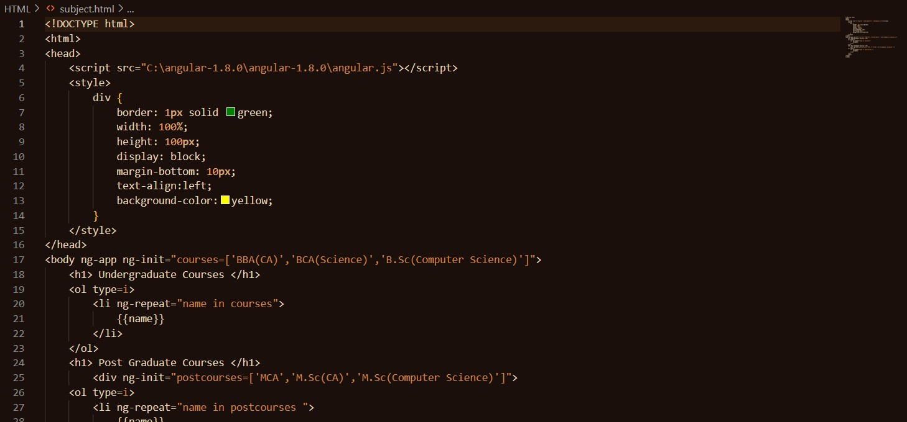

# 🥃 Whiskey Coder Dark Theme

> *A sophisticated, whiskey-inspired dark theme for Visual Studio Code that transforms your coding environment into a warm, elegant workspace.*

<div align="center">


</div>

---

## 🌟 Overview

Whiskey Coder Dark brings the rich, sophisticated ambiance of aged spirits to your development environment. Inspired by the warm golden hues of premium whiskey, oak barrel textures, and amber lighting, this theme creates a comfortable coding atmosphere that's easy on the eyes during those long coding sessions.

## 📸 Screenshots

<div align="center">
  
  <p><em>Rich syntax highlighting with whiskey-inspired colors</em></p>
</div>

### Language Support Examples

<details>
<summary>🔍 View More Language Examples</summary>

<!-- Add more screenshots here as you create them -->
- JavaScript/TypeScript
- HTML/CSS  
- JSON/YAML
- Python
- Java
- And many more!

</details>

## 🎨 Color Philosophy

Our carefully curated color palette draws inspiration from the world of fine whiskey:

| Element | Color | Inspiration |
|---------|-------|-------------|
| **Background** | `#1a0f0a` | Deep whiskey barrel |
| **Foreground** | `#e6d4b7` | Rich cream foam |
| **Primary Accent** | `#d4a574` | Golden amber |
| **Secondary Accent** | `#daa520` | Aged bourbon |
| **Highlights** | Various oak & bourbon tones | Aged wood & spirits |

## 🚀 Installation

### Method 1: VS Code Marketplace *(Recommended)*
1. Open Visual Studio Code
2. Navigate to Extensions (`Ctrl+Shift+X` / `Cmd+Shift+X`)
3. Search for **"Whiskey Coder Dark"**
4. Click **Install**
5. Activate: `Ctrl+K Ctrl+T` → Select "Whiskey Coder Dark"

### Method 2: Manual Installation
```bash
# Clone the repository
git clone https://github.com/subhambera/whiskey-coder-dark-Theme.git

# Copy to VS Code extensions folder
# Windows: %USERPROFILE%\.vscode\extensions
# macOS/Linux: ~/.vscode/extensions
```

### Method 3: VSIX Package
1. Download `.vsix` from [Releases](https://github.com/subhambera/whiskey-coder-dark-Theme/releases)
2. Command Palette (`Ctrl+Shift+P`) → **"Extensions: Install from VSIX..."**
3. Select the downloaded file

## ✨ Features

- 🎯 **Optimized Readability** - Carefully balanced contrast ratios
- 🖥️ **Multi-Language Support** - Enhanced syntax highlighting for popular languages
- 👁️ **Eye-Friendly** - Reduced eye strain with warm, muted tones
- 🎨 **Consistent Design** - Cohesive color scheme across all VS Code elements
- ⚡ **Performance Focused** - Lightweight theme with no performance impact

## 🛠️ Customization

Personalize the theme by adding these settings to your VS Code `settings.json`:

```jsonc
{
  "workbench.colorCustomizations": {
    "[Whiskey Coder Dark]": {
      // Customize editor background
      "editor.background": "#1a0f0a",
      
      // Adjust sidebar colors
      "sideBar.background": "#141008",
      
      // Modify terminal colors
      "terminal.background": "#1a0f0a"
    }
  },
  
  "editor.tokenColorCustomizations": {
    "[Whiskey Coder Dark]": {
      // Override specific syntax colors
      "comments": "#8b6f47",
      "strings": "#cd853f"
    }
  }
}
```

## 🔧 Development

### Quick Start
```bash
# Clone and navigate
git clone https://github.com/subhambera/whiskey-coder-dark-Theme.git
cd whiskey-coder-dark-Theme

# Open in VS Code
code .

# Press F5 to launch Extension Development Host
```

### File Structure
```
whiskey-coder-dark-Theme/
├── 📁 themes/
│   └── Whiskey-Coder-Dark.json     # Main theme file
├── 📁 Screenshots/                  # Theme previews
├── 📄 package.json                 # Extension manifest
├── 📄 README.md                    # This file
├── 📄 CHANGELOG.md                 # Version history
└── 📄 LICENSE                      # MIT License
```

## 🤝 Contributing

We welcome contributions from the community! Here's how to get involved:

<details>
<summary>📋 Contribution Guidelines</summary>

### Ways to Contribute
- 🐛 **Report Bugs** - Found an issue? [Open an issue](https://github.com/subhambera/whiskey-coder-dark-Theme/issues)
- 💡 **Suggest Features** - Have ideas? We'd love to hear them!
- 🎨 **Improve Colors** - Submit pull requests for color improvements
- 📝 **Documentation** - Help improve our docs

### Development Process
1. Fork the repository
2. Create feature branch: `git checkout -b feature/amazing-improvement`
3. Make your changes
4. Test thoroughly in VS Code
5. Commit: `git commit -m 'feat: add amazing improvement'`
6. Push: `git push origin feature/amazing-improvement`
7. Submit a Pull Request

</details>

## 🐛 Issues & Support

Encountered a problem? Please help us improve by reporting it!

**When reporting issues, include:**
- VS Code version (`Help > About`)
- Theme version
- Operating system
- Programming language
- Screenshots (if visual issue)

[🔗 Report Issue](https://github.com/subhambera/whiskey-coder-dark-Theme/issues/new)

## 📋 Requirements

- **VS Code**: Version 1.74.0 or higher
- **System**: Windows, macOS, or Linux

## 📈 Changelog

### [1.0.0] - Initial Release
- ✨ Initial Whiskey Coder Dark theme
- 🎨 Comprehensive syntax highlighting
- 📱 Full VS Code UI theming
- 📚 Multi-language support

*For detailed changes, see [CHANGELOG.md](CHANGELOG.md)*

## 📄 License

This project is licensed under the **MIT License** - see [LICENSE](LICENSE) for details.

## 👨‍💻 Author

<div align="center">

**Subham Bera**

[](https://github.com/subhambera)
[](https://github.com/subhambera/whiskey-coder-dark-Theme)

*Crafted with ❤️ and passion for elegant code*

</div>

## 🙏 Acknowledgments

- 🥃 **Inspiration**: The rich, complex world of aged whiskey
- 🌍 **Community**: VS Code theme developers and users
- 🎨 **Design**: Color theory and accessibility guidelines

## ⭐ Show Your Support

If Whiskey Coder Dark enhances your coding experience:

<div align="center">

[](https://github.com/subhambera/whiskey-coder-dark-Theme)

**🌟 Star the repo • 🔄 Share with friends • ☕ [Buy me a coffee](https://buymeacoffee.com/subhambera)**

</div>

---

<div align="center">

### *"Code like you're savoring a fine whiskey - with patience, appreciation, and style."*

**Happy Coding! 🥃✨**

</div>
