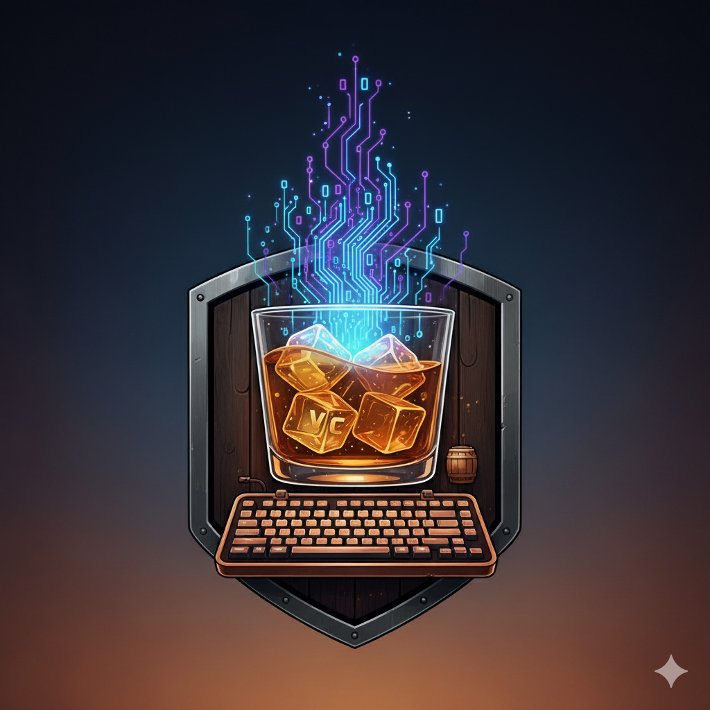

# whiskey-coder-dark README

# 🥃 Whiskey Coder Theme

A rich, warm whiskey-inspired theme for Visual Studio Code that brings the sophisticated ambiance of aged spirits to your coding experience.



## 🌟 Features

- **Dual Themes**: Both Dark and Light variants inspired by whiskey tones
- **Eye-friendly Colors**: Carefully crafted color palette that reduces eye strain during long coding sessions
- **Rich Syntax Highlighting**: Optimized for multiple programming languages
- **Warm Aesthetic**: Amber, golden, and oak-barrel inspired colors create a cozy coding environment
- **Professional Design**: Perfect balance between style and functionality

## 🎨 Color Palette

### Dark Theme
- **Background**: Deep whiskey barrel (`#1a0f0a`)
- **Foreground**: Rich cream (`#e6d4b7`)
- **Accents**: Golden amber (`#d4a574`, `#daa520`)
- **Highlights**: Aged oak and bourbon tones

## 📸 Screenshots

### Dark Theme


## 🚀 Installation

### From VS Code Marketplace
1. Open VS Code
2. Go to Extensions (`Ctrl+Shift+X` or `Cmd+Shift+X`)
3. Search for "Whiskey Coder"
4. Click "Install"
5. Select the theme: `Ctrl+K Ctrl+T` (or `Cmd+K Cmd+T`)

### Manual Installation
1. Clone this repository:
   ```bash
   git clone https://github.com/subhambera/whiskey-coder-dark-Theme.git
   ```
2. Copy the extension folder to your VS Code extensions directory:
   - **Windows**: `%USERPROFILE%\.vscode\extensions`
   - **macOS**: `~/.vscode/extensions`
   - **Linux**: `~/.vscode/extensions`
3. Restart VS Code
4. Select the theme: `Ctrl+K Ctrl+T` (or `Cmd+K Cmd+T`)

### From VSIX
1. Download the `.vsix` file from [Releases](https://github.com/subhambera/whiskey-coder-dark-Theme/releases)
2. Open VS Code
3. Press `Ctrl+Shift+P` (or `Cmd+Shift+P`)
4. Type "Install from VSIX" and select it
5. Choose the downloaded `.vsix` file

## 🎯 Supported Languages

This theme provides optimized syntax highlighting for:

- JavaScript/TypeScript
- JSON/YAML
- And many more!

## 🔧 Customization

Want to customize the theme? You can override specific colors in your VS Code settings:

```json
{
  "workbench.colorCustomizations": {
    "[Whiskey Coder Dark]": {
      "editor.background": "#your-custom-color"
    },
    "[Whiskey Coder Light]": {
      "editor.background": "#your-custom-color"
    }
  }
}
```

## 🤝 Contributing

We welcome contributions! Here's how you can help:

1. Fork this repository
2. Create a feature branch: `git checkout -b feature/amazing-feature`
3. Make your changes
4. Commit your changes: `git commit -m 'Add amazing feature'`
5. Push to the branch: `git push origin feature/amazing-feature`
6. Open a Pull Request

### Development Setup

1. Clone the repository
2. Open in VS Code
3. Press `F5` to launch Extension Development Host
4. Make changes to theme files
5. Reload the Extension Development Host to see changes

## 📝 Changelog

### Version 1.0.0
- Initial release
- Added Whiskey Coder Dark theme
- Added Whiskey Coder Light theme
- Comprehensive syntax highlighting support

## 🐛 Issues & Feedback

Found a bug or have a suggestion? Please open an issue on our [GitHub repository](https://github.com/subhambera/whiskey-coder-dark-Theme/issues).

When reporting issues, please include:
- VS Code version
- Theme version
- Programming language
- Screenshot (if applicable)

## 📋 Requirements

- Visual Studio Code version 1.74.0 or higher

## 📄 License

This project is licensed under the MIT License - see the [LICENSE](LICENSE) file for details.

## 👨‍💻 Author

**Subham Bera**
- GitHub: [@subhambera](https://github.com/subhambera)
- Repository: [whiskey-coder-dark-Theme](https://github.com/subhambera/whiskey-coder-dark-Theme)

## 🙏 Acknowledgments

- Inspired by the rich, warm tones of aged whiskey
- Built with ❤️ for the coding community
- Thanks to all contributors and users

## ⭐ Show Your Support

If you like this theme, please:
- Give it a ⭐ on GitHub
- Rate it on the VS Code Marketplace
- Share it with fellow developers
- Consider [buying me a coffee](https://buymeacoffee.com/subhambera) ☕

---

**Enjoy coding with the warm, rich tones of Whiskey Coder! 🥃✨**

*"Code like you're savoring a fine whiskey - with patience, appreciation, and style."*

## For more information

* [Visual Studio Code's Markdown Support](http://code.visualstudio.com/docs/languages/markdown)
* [Markdown Syntax Reference](https://help.github.com/articles/markdown-basics/)

**Enjoy!**
